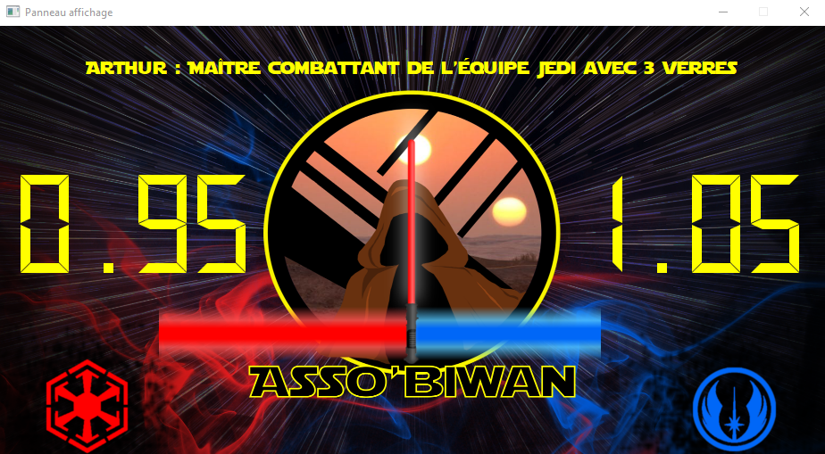
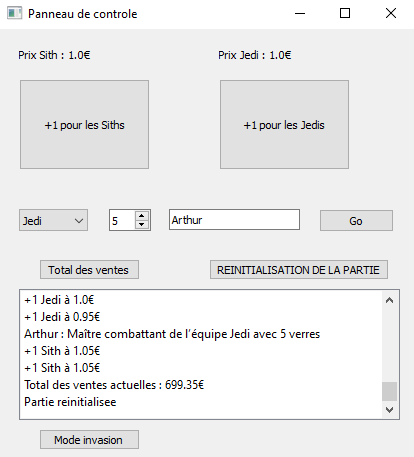

# Assobiwan's drink sales manager


Application used during ISAE-ENSMA's parties to record sales and adapt price over each teams drinks consumption.

Use [pipenv](https://pypi.org/project/pipenv/) with Pipfile provided to create an adequate Python interpreter.


## App's principal
The main window is projected behind the bar, the control window is used by bartenders to register sales.
Tha app displays in real-time the prices of drinks for each teams, Jedis and Siths. The prices varies between 0.80€ and 1.20€ by 0.05€ steps. Prices fluctuate according to a +1/-1 system. A team win a point when one of its member buy a drink, it lose one when the other team get a drink. The 5ct fluctuation affect the prices when a team reachs 5 points. This limit and the size of the main window can be modified with those variables.
```python
   NBR_VENTE_PALIER = 5
   TAILLE_FENETRE = 0.5
```


## Invasion mode

To activate Invasion Mode, click "mode invasion" on the control pannel, click once again to deactivate. During Invasion, prices are set to 1.00€ (regardless of each teams scores). However points are still evolving. Thus prices are differents at the end of Invasion mode from what they used to be at the begining. This mode is used when a team buy a lot of drinks at 0.80€ to avoid financial deficit.

## Control pannel

When a bartender sells a drink, he needs to click "+1 pour les Siths/Jedis" according to the team of the buyer (blue or red wristband). Considerables orders can be displayed, select the team, the number of drinks, the name of the person, click "Go".
All infos are recorded in the log window.
The button "Reinitialisation de la partie" erases all data to restart a game. A confirmation pop-up is used as security.
The button "Totale des ventes" display in logs the current total sales.

